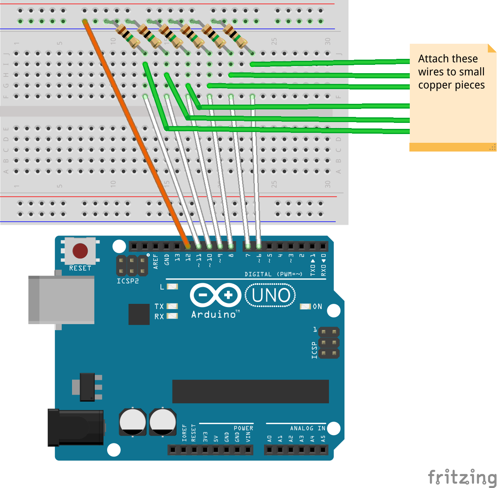

1.  Build this circuit:

    

2.  **Optional:** Plug jumper wires into the ribbon cable and your Arduino as shown in [this Adafruit tutorial](http://learn.adafruit.com/16x24-led-matrix/wiring). Try to match colors if you can; it will make for less (and eaiser) debugging.